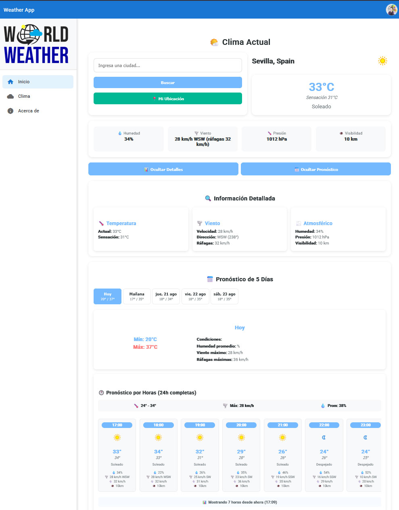

# 🌤️ Weather App Almería

<div align="center">
  
  
  **Una aplicación del tiempo moderna y responsive para Almería**
  
  [](https://angular.io/)
  [](https://nodejs.org/)
  [](https://expressjs.com/)
  [](https://www.typescriptlang.org/)
  
  [🚀 Demo en vivo](#) · [📖 Documentación](#características) · [🐛 Reportar Bug](#contribución) · [💡 Solicitar Feature](#contribución)
</div>

---

## 📋 Descripción

**Weather App Almería** es una aplicación web moderna que proporciona información meteorológica detallada y sin publicidad. Desarrollada con Angular en el frontend y Node.js con Express en el backend, ofrece una experiencia de usuario fluida y responsive optimizada para dispositivos móviles.

### 🎯 Objetivos del Proyecto
- ✨ **Sin publicidad**: Experiencia limpia y enfocada en el contenido
- 📱 **Responsive**: Diseño optimizado para móviles y tablets
- 🌐 **Microservicio**: Backend preparado para escalabilidad y reutilización
- ⚡ **Rendimiento**: Interfaz rápida y ligera
- 🎨 **UX/UI**: Diseño moderno e intuitivo

---

## 🚀 Características

### 🌟 Frontend (Angular)
- **Framework**: Angular con TypeScript
- **Responsive Design**: Adaptable a móviles, tablets y desktop
- **Componentes modulares**: Arquitectura escalable y mantenible
- **Interfaz intuitiva**: Diseño limpio sin distracciones publicitarias
- **Optimización**: Código optimizado para carga rápida

### ⚙️ Backend (Node.js + Express)
- **API RESTful**: Endpoints bien estructurados
- **Microservicio**: Diseñado para reutilización en otros proyectos
- **Express.js**: Framework rápido y minimalista
- **Escalabilidad**: Preparado para crecer según las necesidades
- **CORS**: Configurado para comunicación con el frontend

### 📊 Datos Meteorológicos
- **Información detallada**: Temperatura, humedad, viento, presión
- **Pronóstico extendido**: Predicciones a varios días
- **Ubicación específica**: Enfocado en Almería
- **Actualizaciones en tiempo real**: Datos siempre actualizados

---

## 🛠️ Tecnologías Utilizadas

<table>
  <tr>
    <td align="center"><strong>Frontend</strong></td>
    <td align="center"><strong>Backend</strong></td>
    <td align="center"><strong>Herramientas</strong></td>
  </tr>
  <tr>
    <td>
      • Angular<br>
      • TypeScript<br>
      • HTML5/CSS3<br>
      • RxJS<br>
      • Angular Material
    </td>
    <td>
      • Node.js<br>
      • Express.js<br>
      • JavaScript/ES6+<br>
      • APIs REST<br>
      • CORS
    </td>
    <td>
      • Git<br>
      • NPM<br>
      • Angular CLI<br>
      • Nodemon<br>
      • Postman
    </td>
  </tr>
</table>

---

## 📁 Estructura del Proyecto

```
Angular_tiempo_Almeria/
├── 📁 frontend/                # Aplicación Angular
│   ├── 📁 src/
│   │   ├── 📁 app/
│   │   ├── 📁 assets/
│   │   │   └── 📁 imagenes/
│   │   │       └── home19.jpg  # Interface principal
│   │   └── 📁 environments/
│   ├── angular.json
│   └── package.json
├── 📁 backend/                 # API Node.js + Express
│   ├── 📁 routes/
│   ├── 📁 controllers/
│   ├── 📁 middlewares/
│   ├── server.js
│   └── package.json
└── README.md
```

---

## ⚡ Inicio Rápido

### Prerrequisitos
```bash
Node.js >= 14.x
NPM >= 6.x
Angular CLI >= 12.x
```

### 🔧 Instalación

1. **Clonar el repositorio**
```bash
git clone https://github.com/Yucsan/Angular_tiempo_Almeria.git
cd Angular_tiempo_Almeria
```

2. **Configurar Backend**
```bash
cd backend
npm install
npm start
# Servidor corriendo en http://localhost:3000
```

3. **Configurar Frontend**
```bash
cd frontend
npm install
ng serve
# Aplicación disponible en http://localhost:4200
```

### 🌐 URLs de Desarrollo
- **Frontend**: `http://localhost:4200`
- **Backend API**: `http://localhost:3000`

---

## 📱 Screenshots

<div align="center">
  
  <p><em>Vista principal de la aplicación - Diseño responsive y moderno</em></p>
</div>

---

## 🔮 Roadmap y Futuras Mejoras

### 🎯 Próximas Features
- [ ] **PWA**: Convertir en Progressive Web App
- [ ] **Geolocalización**: Detección automática de ubicación
- [ ] **Notificaciones**: Alertas meteorológicas
- [ ] **Temas**: Modo oscuro/claro
- [ ] **Múltiples ciudades**: Soporte para más ubicaciones
- [ ] **Gráficos**: Visualizaciones de datos meteorológicos
- [ ] **Caché**: Sistema de caché para mejor rendimiento

### 🚀 Expansión del Microservicio
- [ ] **Docker**: Containerización del backend
- [ ] **Base de datos**: Almacenamiento histórico
- [ ] **Rate limiting**: Control de solicitudes
- [ ] **Documentación API**: Swagger/OpenAPI
- [ ] **Testing**: Pruebas unitarias e integración
- [ ] **CI/CD**: Pipeline de despliegue automático

---

## 🤝 Contribución

¡Las contribuciones son bienvenidas! Este proyecto está diseñado como un microproyecto de portfolio, pero está abierto a mejoras y colaboraciones.

### Para contribuir:
1. Fork el proyecto
2. Crea una rama para tu feature (`git checkout -b feature/AmazingFeature`)
3. Commit tus cambios (`git commit -m 'Add some AmazingFeature'`)
4. Push a la rama (`git push origin feature/AmazingFeature`)
5. Abre un Pull Request

---

## 👨‍💻 Autor

**Yucsan**
- GitHub: [@Yucsan](https://github.com/Yucsan)
- Proyecto desarrollado como parte de mi portfolio profesional
- Enfocado en crear microproyectos atractivos con tecnologías modernas

---

## 📄 Licencia

Este proyecto está bajo la Licencia MIT. Ver el archivo [LICENSE](LICENSE) para más detalles.

---

## 🌟 ¿Te gustó el proyecto?

Si este proyecto te resultó útil, ¡dale una ⭐ en GitHub! Esto ayuda a otros desarrolladores a encontrarlo y me motiva a seguir creando contenido de calidad.

---

<div align="center">
  <p><strong>Desarrollado con ❤️ en España</strong></p>
  <p>
    <a href="#-weather-app-almería">⬆ Volver al inicio</a>
  </p>
</div>
